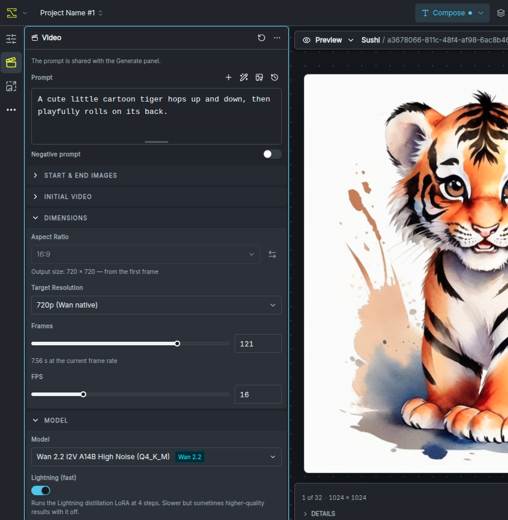
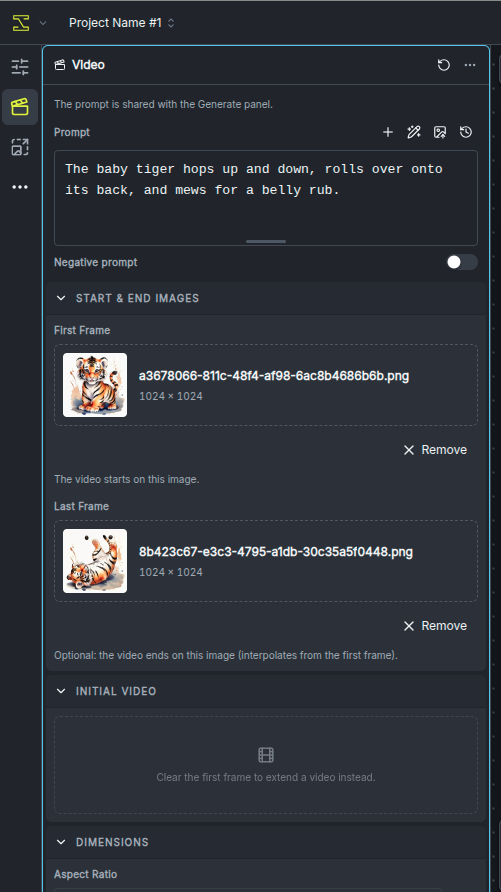
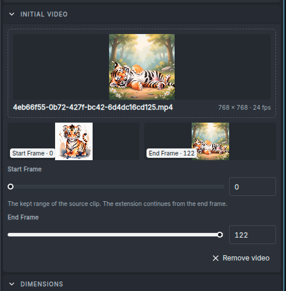
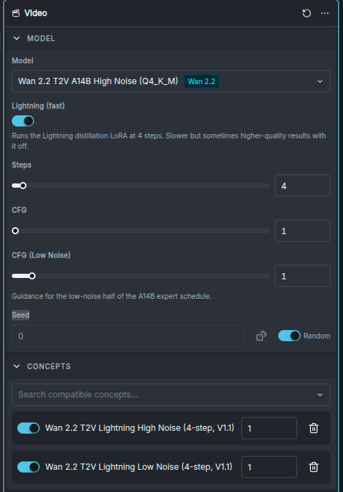

import { Card, CardGrid, Steps } from '@astrojs/starlight/components';

InvokeAI generates short MP4 clips from a text prompt, one or two images, an existing video, a soundtrack — or combinations of those — using three local model families:

* **Wan 2.2** — the Alibaba Wan-AI family: three transformer variants covering text-to-video, image-to-video, first-to-last-frame interpolation, and video extension, with a 4-step **Lightning** fast path.
* **MiniMax H3** — two task transformers, **FL2VA** (first/last-frame-to-video-plus-audio) and **Ref2VA** (reference-to-video-plus-audio), that between them cover every conditioning mode *and* generate a synchronized stereo soundtrack, with a **Turbo** fast path. A [hybrid](#the-hybrid-fl2va-quality-with-ref2va-conditioning) runs the two together.
* **LTX-2** — Lightricks' 22B dual-stream transformer, which generates picture and stereo soundtrack together. It covers text-to-video, first frame, last frame, first-to-last interpolation and video extension, and — because it models both streams — can also generate a **picture for an existing soundtrack** (audio-to-video) or a **soundtrack for an existing picture** (video-to-audio). It ships in a **Dev** build you steer with guidance and a **Distilled** build that renders in eight fixed steps, and Dev has an optional eight-step **Distilled** LoRA fast path.

The easiest way to use any of them is the **Video panel** described on this page — no node graph required. The [bundled video workflows](/features/video-workflows/) expose the same pipelines in the workflow editor for graph-level control.

:::caution[Experimental]
Video generation is a prototype feature. Panel behavior, workflows, and starter-model packaging may change between releases. The underlying models are also new — expect rough edges in coherence and artifacts at longer durations.
:::

---

## The Video panel

Open the **Video** entry in the editor's left rail (next to Generate and Upscale). The panel is a complete video pipeline: type a prompt, pick a model, press **Invoke**, and the finished MP4 appears in the gallery.

### Quick start

<Steps>

1. **Install a video model.** Open the **Model Manager** and install a starter bundle: **Wan 2.2 Text-to-Video**, **Wan 2.2 Image-to-Video**, **MiniMax H3**, or **LTX-2.5**. See [the models](#the-models) below for what each contains and what fits your hardware.

2. **Open the Video panel** and pick your model in the **Model** section. The panel reshapes itself around the selection — sections and fields appear, disappear, and re-range to match what the model can actually do.

3. **Type a prompt** describing the scene and, importantly, the *motion* you want across the clip.

4. **Optionally add conditioning media** — a first frame, a last frame, an initial video to extend, or, on LTX-2, a conditioning clip whose soundtrack or picture the generation completes (see below).

5. **Press Invoke.** The MP4 lands in the gallery and plays in the viewer. On MiniMax H3 and LTX-2 it arrives with a generated audio track.

</Steps>

### The panel adapts to the model

There is no mode switch. The panel infers what to generate from **which inputs you have filled in**, and each model family supports a different set of combinations:

| Inputs you set | What runs | Wan T2V‑A14B | Wan I2V‑A14B | Wan TI2V‑5B | MiniMax H3 | LTX-2 |
|---|---|---|---|---|---|---|
| Prompt only | Text to video | ✓ | — | ✓ | ✓ | ✓ |
| First Frame | Video starts on your image | — | ✓ | ✓ | ✓ | ✓ |
| Last Frame only | Video ends on your image | — | — | — | ✓ | ✓ |
| First + Last Frame | Interpolates between the two | — | ✓ | — | ✓ | ✓ |
| Initial Video | Extends the clip | — | ✓ | ✓ | ✓ | ✓ |
| Initial Video + Last Frame | Extends toward a destination image | — | ✓ | — | ✓ | ✓ |
| Conditioning Clip, *its soundtrack* | Generates a picture for the audio (audio-to-video) | — | — | — | — | ✓ |
| Conditioning Clip, *its picture* | Generates a soundtrack for the video (video-to-audio) | — | — | — | — | ✓ |

MiniMax H3's **Ref2VA** transformer has a mode of its own — reference-conditioned generation — covered [with the model](#minimax-h3).

If you pick a model that can't run the current combination, the Invoke button tells you exactly why instead of failing mid-run.

### Prompt

The prompt toolbar carries the same helpers as the image Generate panel — templates, prompt expansion, image-to-prompt, and history. The **negative prompt** behaves per family:

* **Wan** — used only when CFG is greater than 1 (the field says so). With the Lightning fast path on (CFG 1), it is ignored by the graph.
* **MiniMax H3** — hidden entirely. H3 is guidance-distilled and has no CFG, so a negative prompt has nothing to act on.
* **LTX-2** — offered on the Dev build, where it is pre-filled with the release's own default list of artifact terms, and hidden on the Distilled build, which runs no guidance. On Dev it is also hidden while the [Distilled fast path](#the-distilled-lora-fast-path-on-dev) is on, since that run uses no guidance; turn the toggle off to get it back. With CFG and Audio CFG both at 1 it is dropped from the graph, along with the 12B prompt encode it would have cost.

### Start & End Images

Two drop targets: **First Frame** and **Last Frame**. Drag an image from the gallery (thumbnail or the preview's frame), or upload one.

* A **first frame** anchors the video's opening image (image-to-video).
* A **last frame** anchors where it ends. Combined with a first frame, the model interpolates between the two. On MiniMax H3 and LTX-2 a last frame also works **alone** — the video builds toward your image.
* Setting a first frame **disables the Initial Video section**, and vice-versa: a clip can start from a still or continue a video, not both. The disabled section says which input to clear.

### Initial Video

Drop or upload an existing video to **extend** it. The section shows the clip with a live preview, plus:

* **Start Frame / End Frame sliders** to trim the kept range — small thumbnails show the exact frames at both bounds while you drag.
* The new segment continues from the trimmed clip's end frame and is joined on with a smooth cross-fade.
* Add a **Last Frame** image alongside the initial video to steer where the continuation lands (not available on TI2V‑5B).
* On Wan and LTX-2, the extension **inherits the source clip's frame rate** and the FPS field locks accordingly. MiniMax H3 always generates at its fixed 24 fps.
* On LTX-2 a **Context Frames** control appears under the clip: how many of the source's closing frames — picture *and* sound — the continuation is given, and how long the cross-fade is. Its help text shows how much new material the run will add. See [extending with LTX-2](#extending-with-ltx-2).

Run extend repeatedly — each output can be the next run's initial video — to grow a clip well past a single generation's length. See [making longer videos](#making-longer-videos).

### Conditioning Clip (LTX-2)

With an LTX-2 model selected, the panel offers a **Conditioning Clip** slot. Drop a clip and choose, under **Use from this clip**, which half of it the model is given — it generates the other half:

* **Its soundtrack — generate the picture** (audio-to-video). The clip's audio is held fixed and LTX-2 generates video to match it, down to lip movement. The output carries the **original recording**, not a re-synthesis of it.
* **Its picture — generate the soundtrack** (video-to-audio). The clip's frames are held fixed and LTX-2 generates a soundtrack for them.

The clip decides the run's length: in the soundtrack role the Frames control locks to however many frames the audio covers at the panel's FPS; in the picture role both Frames and FPS come from the clip (FPS stays the panel's if the gallery doesn't know the clip's frame rate). Counts snap *down* to LTX-2's 8·n + 1 grid, so up to seven trailing frames of a clip are dropped. Trim the clip beforehand if you only want part of it.

A few rules follow from how it works:

* The clip excludes every other conditioning input — clear the first frame, last frame and initial video to use one.
* Only the single-pass resolutions (512p, 704p, 768p) can run; with 1024p or 1536p selected, the Invoke button says to pick another. A [two-stage](#two-stage-presets) refine pass re-noises everything, which would undo the held stream.
* In the picture role, the output carries **your original footage** at its own resolution with the new soundtrack. The model itself sees the clip resized to the generation canvas, whose aspect ratio the panel takes from the clip, so the soundtrack is generated for the whole frame.
* To give LTX-2 a bare soundtrack — a song, a voice recording — upload the audio file to the gallery. It becomes a clip whose frames draw the waveform, and dropping it here selects the soundtrack role automatically.

Describe the scene you want in the prompt either way; for audio-to-video, saying who or what is making the sound ("a woman singing to the camera") is what lets the model tie picture to audio.

### Dimensions

* **Aspect Ratio** presets (21:9 through 9:21) drive text-to-video output. As soon as conditioning media is set, **its aspect ratio takes over** and the preset locks — the readout names the source ("from the first frame").
* **Target Resolution** picks the size tier within that ratio:
  * Wan — **480p** and **720p** (native), **1080p** (extrapolated beyond the training distribution; expect softer results).
  * MiniMax H3 — **768 highres** (native: short edge 768) and **768 lowres** (fast preview: long edge 768).
  * LTX-2 — **512p**, **704p** (default) and **768p** in one pass; **1024p** and **1536p** are [two-stage](#two-stage-presets), and much slower.
  The panel derives exact pixel dimensions automatically, snapped to each model's grid — you never do the multiple-of-16/32 math yourself.
* **Frames** sets clip length:
  * Wan — any 4·n+1 count from 5 to 161; default **81** (5 seconds at the default 16 fps). The training distribution is 81; longer values degrade coherence.
  * MiniMax H3 — a snapped slider over the model's fixed grid (90 to 345 in steps of 17); default **124** (about 5 seconds at 24 fps).
  * LTX-2 — any 8·n+1 count; the slider covers 9 to 241 and the field accepts up to 481. Default **121** (5 seconds at 24 fps). A conditioning clip sets it for you.
* **FPS** — editable on Wan (default 16) and LTX-2 (default 24, range 1–60), locked on both while extending (see above); fixed at 24 on MiniMax H3. On LTX-2 the frame rate also sets how much audio is generated, and a conditioning clip in the picture role supplies its own.

### Model

Model select plus the sampling controls:

* **Steps** and **CFG** (Wan A14B additionally exposes **CFG (Low Noise)** for the second expert — see [the experts](#high-noise-and-low-noise-transformers-a14b-variants-only)). LTX-2 Dev adds a collapsed [Advanced guidance](#advanced-guidance-dev-only) section; LTX-2 Distilled shows its eight steps as fixed and no guidance at all.
* **Seed** with a randomize toggle.
* The **fast-path toggle** — **Lightning** on Wan A14B, **Turbo** on MiniMax H3, **Distilled** on LTX-2 Dev. When the matching distillation LoRA is installed the toggle defaults **on**, setting the distilled step count (4 for Lightning, 6 for Turbo, 8 for Distilled) and CFG 1 — on LTX-2 it also turns Audio CFG, STG and modality guidance off. Turning it off restores the model's full-quality defaults (40 steps / CFG 5 on Wan, 50 steps on H3, 30 steps with the released guidance on LTX-2). The toggle works by adding or removing the LoRA in the Concepts list — what you see there is exactly what runs.

### Concepts

Add your own style/subject LoRAs, just like the image panel — on all three families, including LTX-2. Compatibility is enforced per family — an A14B LoRA can't run on TI2V‑5B (the tensor shapes differ), and the panel says so rather than silently dropping it.

### Model Components

What appears here depends on the model:

* **Wan single-file (GGUF/checkpoint) mains** need their supporting pieces: either a **Component Source** (any Diffusers Wan install, which supplies the text encoder and VAE) or a standalone **VAE** and **Wan T5 Encoder**. A14B mains also get a **Transformer (Low Noise)** slot for the second expert — without it, the high-noise expert runs the whole schedule.
* **Wan Diffusers mains** bundle everything; the section stays collapsed.
* **LTX-2** transformer mains always need two components: **Model components**, an LTX-2 components install supplying the VAEs, vocoder, text connectors and latent upscaler, and a **Gemma-4 encoder** — no LTX-2 model carries its own text encoder.
* **MiniMax H3** single-file transformer mains need **Model components** — a Diffusers H3 install that supplies the tokenizer, processor, and VAEs — plus a single-file **Text encoder** when that install carries no text-encoder weights (the starter bundle's does not). A **Ref2VA** main also offers the optional **Hybrid quality base (FL2VA)** slot and, once a base is picked, a **Ref2VA AdaLN from block** slider — see [the hybrid](#the-hybrid-fl2va-quality-with-ref2va-conditioning).

If a Wan A14B pairing looks mis-wired — for example a low-noise-tagged file in the main slot — the panel shows a **non-blocking advisory** beneath the slots with a one-click **Swap experts** action. The tags come from a filename heuristic and your explicit wiring always wins, so deliberate cross-wiring still runs (the backend logs the same warning at generation time).

### Recalling parameters

Video generations record their parameters as metadata. Select a video in the gallery and use **Recall parameters** (in the viewer's header or the context menu) to load its prompt, model, dimensions, frames, LoRAs, and conditioning back into the Video panel — the same round-trip the image panel offers. Media that no longer exists is cleared rather than silently substituted. The MiniMax H3 hybrid is part of the record too: recalling a hybrid video restores its base and start block, and recalling a video made without the hybrid clears the slot. LTX-2 records carry their guidance scales, extend context length and conditioning clip with its role.

The record travels **inside the MP4**, the way an image's does inside its PNG. Download a video, upload it to any Invoke install — yours or someone else's — and **Recall parameters** works there too: models are matched by content hash when the other install's model keys differ, and conditioning media that only existed in the original gallery is simply left empty. The [Media Metadata](/development/architecture/media-metadata/) reference documents the record's fields and versioning.

---

## The models

### Wan 2.2

Wan 2.2 ships three transformer variants, plus a shared text encoder and two VAEs. All share the same diffusion-style sampling but differ in size, conditioning, and intended task.

| Variant | Task | Params | VAE | Conditioning |
|---|---|---|---|---|
| **T2V-A14B** | Text → Video | 14B × 2 experts | A14B VAE (16-ch, 8× spatial) | Text only |
| **I2V-A14B** | Image+Text → Video | 14B × 2 experts | A14B VAE (16-ch, 8× spatial) | Text + reference image (36-channel concat) |
| **TI2V-5B** | Text → Video OR Image+Text → Video | 5B (single) | Wan 2.2-VAE (48-ch, 16× spatial) | Text, optionally with reference image (first-frame mask blend) |

* **T2V-A14B** generates videos from a text prompt alone. Best motion coherence and prompt-following of the three.
* **I2V-A14B** locks the first frame to a reference image you supply, and also handles first-to-last interpolation and extension. Best subject-preservation.
* **TI2V-5B** is the small single-expert variant. It does both text-to-video and image-to-video at substantially lower VRAM, with somewhat less stable long-range coherence.

#### High-noise and low-noise transformers (A14B variants only)

The A14B models are a **mixture-of-experts (MoE)** pair — *two* 14B transformers per variant. The denoise loop swaps between them at a model-defined boundary timestep:

* **High-noise expert** runs early, when the latents are still mostly noise: composition, layout, broad motion.
* **Low-noise expert** runs late, when the latents are close to clean: detail and texture.

InvokeAI handles the swap automatically. In the Video panel, a single-file A14B main takes its partner through the **Transformer (Low Noise)** component slot; a Diffusers A14B main carries both experts internally. **TI2V-5B is single-expert** — no swap, no low-noise CFG, no second slot.

#### Lightning (the Wan fast path)

The stock A14B variants need ~40–50 denoise steps. The **Lightning distillation LoRAs** collapse that to **4 steps** at CFG 1 with minimal quality loss — about a 10× speedup. There's a pair per variant (one per expert); the panel's Lightning toggle wires both automatically.

:::tip
**TI2V-5B has no Lightning LoRA.** Its smaller size makes each step cheap; run it at 40–50 steps for a similar wall-clock to A14B + Lightning.
:::

#### Installing Wan models

Two **starter bundles**:

* **Wan 2.2 Text-to-Video** (~36 GB) — UMT5-XXL text encoder, both VAEs, TI2V-5B Q4_K_M, T2V-A14B Q4_K_M (high + low), T2V Lightning (high + low).
* **Wan 2.2 Image-to-Video** (~32 GB) — UMT5-XXL, A14B VAE, I2V-A14B Q4_K_M (high + low), I2V Lightning (high + low).

The bundles are independent; installing both totals ~56 GB (shared components are deduplicated). Higher-quality Q8_0 quantizations and full Diffusers builds are available a-la-carte in the starter models list.

:::tip
**On a 12 GB VRAM card**: install just the Text-to-Video bundle and use TI2V-5B — it covers both text-to-video and image-to-video and fits comfortably. The A14B variants will technically run via aggressive offloading but are slow and prone to OOM.
:::

### MiniMax H3

MiniMax H3 ships as two task transformers that share every other component. **FL2VA** — *first/last-frame to video with audio* — covers text-to-video, first frame, last frame, both, and extend. **Ref2VA** — *reference to video with audio* — conditions a new clip on **reference media**: up to 3 videos and 9 images, in an order you choose (order changes the result). Every generation from either includes a **jointly generated stereo soundtrack**, muxed into the MP4 as AAC.

The panel switches task by transformer: select the Ref2VA single-file transformer as the **Model** and the conditioning sections become the ordered **References** list; select the FL2VA transformer to get the five frame/extend modes back. A video reference can contribute its image track, its soundtrack, or both — soundtrack-only references must be paired with at least one visual reference. Image references default to a high-detail 2048 px encoding ("Max"); the "Match generation size" option is several times faster at some fidelity cost.

What makes it different from Wan in practice:

* **Guidance-distilled** — there is no CFG and no negative prompt. Prompt adherence is baked in; the panel hides both controls.
* **Fixed 24 fps** and a fixed frame grid: 90–345 frames in steps of 17 (about 3.8 to 14.4 seconds), default 124.
* **768-class canvas** — "768 highres" pins the short edge to 768 (native quality); "768 lowres" pins the *long* edge to 768 for fast previews. Aspect ratios from 1:4 to 4:1 are supported, wider than the preset list.
* **Turbo fast path** — step-distillation LoRAs render in ~6–8 steps instead of ~50. The panel's Turbo toggle defaults on when one is installed (6 steps).
* **Conditioning text encoder** is a truncated **Qwen3-VL-32B** — a vision-language model, which is why H3 follows detailed scene descriptions well.

#### The hybrid: FL2VA quality with Ref2VA conditioning

The two transformers are not equal. FL2VA produces the cleaner output; Ref2VA is the only one that takes references, but a known training defect degrades what it generates — video and audio artifacts that FL2VA does not show. A tensor-by-tensor comparison of the two checkpoints shows they differ almost only in their per-block **AdaLN modulation projections** — the small time-conditioning layers that tell each block how far along the denoise it is. Attention, MLPs, and output heads are near-identical.

The **hybrid** exploits that: it runs the FL2VA transformer with Ref2VA's AdaLN projections swapped in for the upper part of the network. References still route (the task is decided by those projections), while everything else keeps FL2VA's quality.

To use it:

1. Select the **Ref2VA** transformer as the **Model**, as for any reference generation.
2. Under **Model Components**, pick the FL2VA transformer in **Hybrid quality base (FL2VA)**. The slot lists only files of the same kind as the model — pruned with pruned, full with full — because the projections have different shapes otherwise.
3. Leave **Ref2VA AdaLN from block** at its default of **25** to start. H3 has 50 blocks (0–49); blocks from the chosen one through 49 keep Ref2VA's projections, earlier blocks use FL2VA's. Lower values follow the references more closely at more of Ref2VA's quality cost; higher values are cleaner but weaker on adherence.

Nothing is merged or written to disk: at generation time the loader loads the FL2VA base and the selected AdaLN tensors are read from the Ref2VA file and swapped in for the duration of the run. On the pruned starter repacks that costs about 40 MB of RAM; full-size pairs cost far more (roughly 520 MB per selected block). The **Turbo** toggle keys off the model, so it picks the Ref2VA Turbo LoRA (8 steps with the LightX2V release); the FL2VA Turbo can be added by hand under **Concepts** as an experiment, since neither distillation saw the hybrid's mixed path. Your own LoRAs apply on top of the hybrid as usual.

The hybrid is an experiment adopted from the community — see the acknowledgements below. Early renders with the defaults were free of the artifacts Ref2VA alone produced, but judge it on your own results rather than treating it as a fixed improvement.

#### Installing MiniMax H3

The **MiniMax H3** starter bundle (~85 GB) installs the working set:

* **MiniMax H3 FL2VA Transformer (int8, pruned)** and **MiniMax H3 Ref2VA Transformer (int8, pruned)** (~21 GB each) — single-file transformer builds. **One of these is the model you select in the Video panel**, and the one you pick decides the task: FL2VA for the frame/extend modes, Ref2VA for reference conditioning (with FL2VA optionally in the hybrid base slot).
* **MiniMax H3 Components** (~11 GB) — the Diffusers-format install of the tokenizer, processor, and video + audio VAEs, which goes in the panel's **Model components** slot — plus **MiniMax H3 Text Encoder (int8)** (~27 GB), the single-file build for its **Text encoder** slot (the Components install carries no text-encoder weights). The bundled templates wire them the same way.
* **MiniMax H3 Turbo LoRA**, **MiniMax H3 LightX2V Turbo LoRA**, and **MiniMax H3 LightX2V Ref2V Turbo LoRA** — independent step-distillation LoRAs; the Turbo toggle picks the one matching the selected task (the Ref2V build is trained against the Ref2VA transformer only). The earlier 4-step *MiniMax H3 Ref2V Turbo LoRA* (v0.1) is no longer a starter: it pans the camera rightward whenever a video reference is used. If you still have it installed, the toggle prefers the LightX2V release once that is installed too.

Reference conditioning adds rows to every denoising step roughly linearly: a few references typically cost ~1–2 GiB of extra activation memory, but a full-detail 2048×2048 image reference alone adds ~4096 rows (about 1 GiB), and three full-length video references can triple the packed sequence. Prefer "Match generation size" for image references and trimmed clips for video references on smaller cards.

H3 is the heaviest local video option — With 16 GB VRAM, `enable_partial_loading` enabled and 32 GB of system RAM it can create a full 345 frame video (about 14s) at 768x768 resolution, but for larger or longer videos a high-VRAM GPU (24 GB+) is strongly recommended.

:::caution[License restrictions]
MiniMax H3 is distributed under the **MiniMax H3 Community License**, which restricts use by territory (currently excluding the US, EU, UK, and South Korea) — and the restriction **extends to model outputs**. Review the terms at [huggingface.co/MiniMaxAI/MiniMax-H3](https://huggingface.co/MiniMaxAI/MiniMax-H3) before installing. The Turbo LoRAs themselves are Apache 2.0.
:::

---

### LTX-2

LTX-2 is Lightricks' 22B **dual-stream** transformer: picture and soundtrack are generated *together*, by the same model, at every denoising step — not dubbed on afterwards. It ships in two builds that share every other component:

* **Dev** — the guided build. It samples a 30-step schedule and exposes four guidance controls (see below).
* **Distilled** — guidance-distilled to a fixed **eight-step** schedule. It runs one model evaluation per step where Dev runs up to four, which makes it roughly fifteen times cheaper per clip. Guidance has no effect on it, so the panel hides those controls and shows the step count as fixed.

Both builds support every LTX-2 mode — text, first frame, last frame, first-to-last, extend, audio-to-video and video-to-audio — and your own LTX-2 LoRAs.

What to know in practice:

* **Frames are 8·n + 1** (the video VAE encodes the first frame alone, then groups of eight): 9 to 481, default 121 — five seconds at the default 24 fps. The slider stops at 241; the field accepts more for a deliberate long render, but cost grows linearly with the frame count.
* **Frame rate is yours to set** (1–60 fps). It changes the clip's duration, and with it how much audio is generated — the two streams share one clock.
* **Canvas presets pin the short edge**, with the long edge following your aspect ratio: 512p, 704p (default) and 768p render in one pass and snap to a multiple of 32; 1024p and 1536p are [two-stage](#two-stage-presets) and snap to 64, because the first pass runs at half of them.
* **Image-to-video re-compresses your frame** as a single H.264 frame before encoding it. That is deliberate: the model was trained on frames that had been through a video codec, and a pristine PNG is far enough out of that distribution that the clip visibly drifts away from it over the first second.
* **The negative prompt** only reaches the model through classifier-free guidance, so it is available on Dev and hidden on Distilled. It is pre-filled with the release's own default, a long list of artifact and audio-defect terms.

#### Advanced guidance (Dev only)

Beyond the usual **CFG**, LTX-2 exposes three more terms in a collapsed **Advanced guidance** section. Each one costs an extra model evaluation per step, so turning one off is a real saving:

* **Audio CFG** (default 7) — how hard the soundtrack follows the prompt. The release guides audio far harder than picture.
* **STG** (default 1) — spatio-temporal guidance. Steers away from a pass with one attention block skipped, which sharpens motion. 0 turns it off.
* **Modality guidance** (default 3) — steers away from a pass with the audio/video cross-attention disabled, tightening how well the two streams agree. 1 turns it off.

#### Two-stage presets

The **1024p** and **1536p** target resolutions are *two-stage*. LTX-2 generates at half the canvas, doubles the latent with a dedicated x2 upscaler, then runs a second, shorter denoise over it. The upscaler alone produces a soft latent; the refine pass is what resolves it, so the output is larger without going soft. The soundtrack skips the upscaler, having no spatial extent, but is carried through the second pass so the two streams stay on one trajectory.

The refine pass is the expensive half: it runs at four times the base pass's token count. Dev evaluates the model four times per step, so a Dev refine step costs four times a Distilled one — which is why the Dev refine runs a smaller step budget than its base pass rather than the same one. Expect minutes for Distilled at 1024p and hours for Dev at 1536p.

A first frame is anchored on both passes, encoded once at each canvas. The refine pass re-noises every frame including the first, so an anchor that was only applied to the base pass would not survive into the output. The same holds for the opening of an extension. A [conditioning clip](#conditioning-clip-ltx-2), which holds a whole stream fixed, cannot run two-stage at all.

#### The Distilled LoRA (fast path on Dev)

The **LTX-2.5 Distilled LoRA** turns the Dev transformer into an eight-step, guidance-free model like the Distilled build. With it installed, the Dev model's **Distilled** toggle defaults on: it adds the LoRA, sets eight steps and turns every guidance scale off, so each step is one model evaluation instead of four. Turn it off to return to the guided 30-step recipe.

Why use it rather than the Distilled transformer? It keeps a single ~19 GB transformer on disk that can run either way. The LoRA is large for a LoRA (~8.9 GB) because distillation changes the whole network. The toggle is only offered on Dev: the Distilled build already is that model.

#### Last frames and keyframes

A **Last Frame** works alone or with a first frame, as on MiniMax H3. Unlike a first frame, which directly replaces the clip's opening, a last frame is added to the model's input as an extra *keyframe* positioned at the clip's final frame, and the generated frames are steered toward it. A last frame can also be combined with an **Initial Video** to steer where an extension lands.

#### Extending with LTX-2

LTX-2 continues a clip from its **closing frames and closing sound**, not from a single still. The final *Context Frames* of the trimmed source (default **17**, about 0.7 s at 24 fps) are held fixed at the start of the new clip, picture and audio together, so the model sees the motion and sound it is continuing. The same span is then cross-faded to join the new clip to the source, so the join blends two copies of the same moment rather than two different ones.

Context comes out of the frame budget: the extension adds **Frames − Context Frames** new frames, and the Context Frames help text shows that number. Trade-offs when choosing it:

* **Longer context carries more of the source.** 17 frames is enough for motion and the *tone* of a sound, but only about a syllable of it: extending a song at 17 tends to flatten the continuation into a sustained note. Raising context to 33–49 restores rhythm and cadence.
* **Raise Frames with it.** At 121 frames, context 17 adds 104 new frames; context 49 adds only 72.
* **The ceiling depends on the source.** The join must fit the overlap in memory at the source's own resolution, so large sources cap Context Frames lower. The control's maximum already reflects this.

Context Frames steps along the same 8·n + 1 grid as Frames (9, 17, 25, 33 …).

#### Audio-to-video and video-to-audio

LTX-2 generates picture and soundtrack as one sequence, so it can hold either stream fixed and generate only the other — the same mechanism a first frame uses to hold one image fixed, applied to a whole stream. The panel exposes this as the [Conditioning Clip](#conditioning-clip-ltx-2):

* **Audio-to-video** encodes the clip's soundtrack and keeps it fixed at every step. Because the model has always learned picture and sound together, it lines the video up with the audio — a face speaking or singing to camera gets matching lip movement. The output contains the original recording, so nothing is lost from the audio. The two modes are mirror images: each returns the stream you supplied untouched.
* **Video-to-audio** keeps the clip's frames fixed and generates a soundtrack. The output is your original footage, frame for frame, with the generated soundtrack muxed in.

Both run on the single-pass canvases only. Guidance applies as usual on Dev; in particular **Audio CFG** is the one that steers a video-to-audio soundtrack toward the prompt.

#### Installing LTX-2

The **LTX-2.5** starter bundle installs the working set:

* **LTX-2.5 Dev Transformer (int8)** and **LTX-2.5 Distilled Transformer (int8)** (~18 GiB each) — single-file transformer builds. **One of these is the model you select in the Video panel**, and which one you pick decides the schedule.
* **LTX-2.5 Components** — the video VAE, audio VAE, vocoder, text connectors and the x2 latent upscaler, which go in the panel's **Model components** slot. The upscaler is what the two-stage presets need; a hand-assembled components folder without it fails when the refine pass begins, after the first pass has already run.
* **LTX-2.5 Text Encoder (Gemma-4 12B, int8)** — the Lightricks-tuned Gemma-4 text tower, which goes in the **Gemma-4 encoder** slot. No LTX-2 model carries text-encoder weights, so this one is required rather than an override.

Available separately in the starter models list:

* **LTX-2.5 Distilled LoRA** (~8.9 GB) — the [fast path](#the-distilled-lora-fast-path-on-dev) for the Dev transformer. Not needed if you use the Distilled transformer.
* **LTX-2.5 Dev Transformer (bf16)** (~38 GB) and **LTX-2.5 Text Encoder (Gemma-4 12B, bf16)** (~24 GB) — unquantized builds, for a 48 GB+ card or partial loading.

LTX-2 does not condition on the last hidden state of its text encoder the way most models do: it stacks the hidden states of *every* Gemma layer and runs them through a separate connector model. That is why the encoder is a large, separate download.

Measured on a 48 GB card at 1248×704×121 frames, the int8 Dev transformer is resident at ~18 GiB and the denoise working set peaks at ~2.8 GiB, with all four guidance passes running. The Distilled build at the same size needs the same memory and about a fifteenth of the time.

:::caution[License]
LTX-2.5 is distributed under the **LTX-2.x Community License**, which is free for entities under $10M in annual revenue. Review the terms at [huggingface.co/Lightricks/LTX-2.5](https://huggingface.co/Lightricks/LTX-2.5) before installing.
:::

---

## Making longer videos

Every family is trained on short clips — Wan on 81 frames (~5 s), H3 on up to 345 (~14 s), LTX-2 on 121 (~5 s at 24 fps). Asking for more frames in one generation pushes the temporal positional encoding out of distribution and coherence degrades. The way to go longer is to **extend**: generate a clip, then continue it, repeatedly.

Extension is available on all three families. LTX-2's continues the soundtrack as well as the picture; see [extending with LTX-2](#extending-with-ltx-2) for its Context Frames control.

### From the Video panel

<Steps>

1. **Generate your opening clip** (any mode).

2. **Drag it from the gallery into the Initial Video field.** Trim off any weak tail with the End Frame slider — the last frames of a generation are occasionally its worst.

3. Optionally set a **Last Frame** image to steer where the continuation lands.

4. **Invoke.** The panel renders the continuation and joins it to your source with a cross-fade, delivering one combined MP4. On MiniMax H3 and LTX-2 the soundtrack is carried across the join too.

5. **Repeat** with the new output as the next initial video.

</Steps>

### Quality drift across iterations

Each iteration's source is itself a generation output, so artifacts compound — by the 4th or 5th extension you may see softening or color drift. Mitigations:

1. **Trim the bridge point a few frames back from the end** — boundary frames are the most artifact-prone.
2. **Refresh a bridge frame with a low-strength img2img pass** (SDXL or FLUX at ~0.2 strength) before using it as a first frame for the next segment.
3. **Don't chain more than 4–5 segments** without refreshing in between.

Also, be aware that the extended video only has access to information present in the bridge frames (the end of the previous video — a single frame on Wan, a few on LTX-2). So if a character in the first video has their face obscured at that point, the character's face may be completely different in the extended part of the video.

### In the workflow editor

The **Extend Video** workflows (Wan, MiniMax H3 and LTX-2) expose the same machinery as graphs, including the `Concatenate Videos` node's transition modes (`cut`, `crossfade`, `fade_through_black`) and `Frame from Video` for manual frame-bridging chains. See the [Video Workflows guide](/features/video-workflows/).

---

## Troubleshooting

### OOM errors

Video denoise is memory-intensive — attention scales roughly as `(T_lat × H/16 × W/16)²`, so resolution and frame count both quadratically affect peak VRAM.

For Wan, add `wan_memory_optimization: true` to `invokeai.yaml` and restart to target about 2 GiB of resident transformer weights when `enable_partial_loading` is enabled, lower denoise activation memory, and stream untiled VAE decode directly to MP4. This can make generation substantially slower and requires enough system RAM for offloaded weights.

* **Drop resolution before frame count.** 1280×720 → 832×480 is a ~2.4× memory drop; on H3, switch Target Resolution to **768 lowres**.
* **TI2V-5B before A14B.** TI2V-5B Q4_K_M peaks around ~6–8 GB at 832×480, versus ~12–14 GB for A14B Q4_K_M.
* **OOM at the *reference image encoder* step** is usually allocator fragmentation from a previous run. Restart the server and try again; if it recurs reproducibly, file an issue.

### Late-frame artifacts (text, color blobs)

If a video looks great for most of its duration but the last ~20% develops text, watermarks, or floating colored shapes, that's the model's training-data prior leaking through as temporal coherence weakens. It's most common on TI2V-5B.

* On Wan (with CFG > 1), add to the negative prompt: `text, watermark, logo, subtitles, chinese characters, kanji, ticker, banner`
* Describe the *action* you want through the clip, not just the static scene
* Stay at the default frame count; longer pushes temporal RoPE out of distribution

### The Invoke button is disabled

The panel validates before enqueueing, and the button's tooltip lists every reason: an unsupported input combination for the selected model, a missing required component (Wan single-file mains need a VAE and encoder or a component source), a LoRA targeting the wrong Wan family, conditioning media whose aspect ratio H3 can't reach (outside 1:4–4:1), an LTX-2 conditioning clip paired with a two-stage resolution, or an LTX-2 extension whose Context Frames is at least Frames, exceeds the trimmed source's length, or is too large for the source's resolution. Fix what it names and the button re-arms.

### TI2V-5B VAE state-dict load error

If decode fails with `size mismatch for ... AutoencoderKLWan`, the **wrong VAE** is wired for the transformer: TI2V-5B needs the 48-channel Wan 2.2 VAE, the A14B variants the 16-channel Wan 2.1 VAE. In the panel, pick the matching VAE in Model Components (the selector already filters to compatible channel counts when the model reports them).

### Preview images don't appear

1. **A video is already loaded in the viewer** — the progress preview overlays it. If missing entirely, hard-refresh the browser (`Ctrl+Shift+R` / `Cmd+Shift+R`).
2. **`Show progress in viewer` is disabled** — check the gallery settings (gear icon).

### Pipeline runs but the final MP4 is glitchy

Almost always a **VAE mismatch** (16-ch vs 48-ch on Wan) or a scheduler override. Use the auto-selected scheduler and the family-matched VAE.

---

## Acknowledgements

Wan 2.2 model family by the Alibaba Wan-AI team; Lightning distillation LoRAs by [lightx2v](https://huggingface.co/lightx2v/Wan2.2-Lightning); GGUF quantizations by [QuantStack](https://huggingface.co/QuantStack). MiniMax H3 by [MiniMax AI](https://huggingface.co/MiniMaxAI/MiniMax-H3); int8 single-file repacks by [Comfy-Org](https://huggingface.co/Comfy-Org/MiniMax-H3); Turbo distillation LoRAs by [larryvrh](https://huggingface.co/larryvrh/MiniMax-H3-Turbo-Lora) and [LightX2V](https://huggingface.co/lightx2v/Minimax-h3-Turbo). The FL2VA/Ref2VA hybrid follows the per-tensor analysis and reference implementation in [scottmudge/ComfyUI_MinimaxH3HybridLoader](https://github.com/scottmudge/ComfyUI_MinimaxH3HybridLoader). LTX-2.5 by [Lightricks](https://huggingface.co/Lightricks/LTX-2.5); per-component int8 repacks and distilled LoRA by [DeepBeepMeep](https://huggingface.co/DeepBeepMeep/LTX-2).
